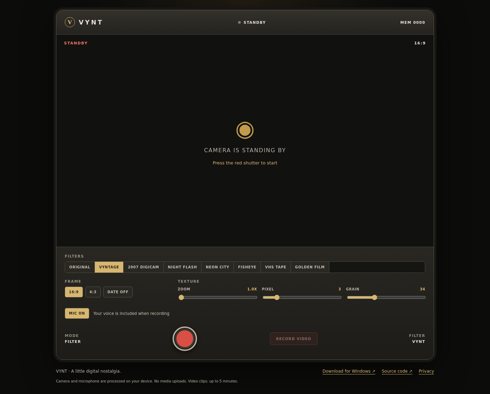

# VYNT

**Your camera, a little digital nostalgia.**

A local-first Y2K photo booth built with React, TypeScript, Canvas and Electron. Eight live filter modes, textured photos, and short videos with optional microphone audio. Use the browser demo or install the Windows desktop app.

[Download for Windows](https://github.com/Yash-Tripath1/Vynt/releases/latest) · [Report an issue](https://github.com/Yash-Tripath1/Vynt/issues) · [Publishing guide](docs/PUBLISHING.md)

> The included workflow deploys the browser demo to **https://yash-tripath1.github.io/Vynt/** after GitHub Pages is enabled and the workflow succeeds.


## What it does

- **Eight live filters:** Original, Vyntage, 2007 Digicam, Night Flash, Neon City, Fisheye, VHS Tape and Golden Film.
- **Canvas-rendered texture:** adjustable zoom, pixelation and grain, plus a date imprint.
- **Two frames:** 16:9 and 4:3.
- **PNG photos:** full capture resolution, with a temporary last-photo preview.
- **Local processing:** no media uploads, accounts, advertising or app analytics.
- **Browser + desktop:** downloads in the browser, native Save As dialogs on desktop.

## Try it

1. In the desktop version, download the **`VYNT-Windows-<version>-Setup.exe`** installer from Releases. Do not download a standalone executable copied out of an unpacked app folder.
2. Open VYNT. Press the red shutter and allow camera access.
3. Choose a filter and texture settings. Press the shutter again to save a photo.
4. Leave **MIC ON** to include your voice, then select **RECORD VIDEO** and allow microphone access. Select **STOP** to finish and save/download the clip.
5. Use **TURN OFF** to release the camera. Microphone access ends when recording stops.

If microphone access is denied, VYNT tells you rather than silently recording without your voice. Fix the permission or choose MIC OFF. On Windows, check **Settings → Privacy & security → Microphone/Camera**, including access for desktop apps.

### Compatibility and limits

- Windows x64 is the prepared installer target. Test the installer on Windows 10/11 before publishing a release; Windows 10 OS support is separate from app compatibility.
- The web demo targets recent Chrome/Edge on desktop. Other browsers/devices may differ in camera access, download behaviour and codec support. Safari/iOS and Android need separate device testing.
- Web camera/microphone access requires HTTPS (localhost is allowed for development). Open the demo directly rather than in an iframe that may block permissions.
- Videos use WebM when supported, with MP4 as a capability-detected fallback. System/computer audio is **not** recorded.
- Video captures the 640-pixel-wide preview at up to 30 fps; photo capture is 1280×720 or 1200×900. Actual recording frame rate depends on device performance and filter complexity.
- Clips are capped at five minutes with a roughly 200 MiB recording-data safeguard. Media is buffered in memory; avoid long sessions on low-memory devices. Do not background a mobile browser while recording.
- There is no persistent in-app gallery. Save/download media before closing. Closing during a pending save or recording can lose unsaved media.
- The installer is unsigned unless a signing certificate is configured; Windows may show an unknown-publisher/SmartScreen warning. This project does not claim Microsoft Store certification.

## Develop

Use **Node.js 22.12+** (Node 22 LTS recommended).

```bash
npm ci
npm run dev:web       # browser only
npm run dev           # Electron desktop development
```

```bash
npm run build:web     # static website in dist/
npm run build:win     # Windows NSIS installer; run on Windows or use GitHub Actions
npm run lint
npm run typecheck
```

Deploy **only `dist/`** for the web. Do not use the default desktop build command on a static host. For Vercel/Netlify, use `npm run build:web` with output directory `dist` and Node 22. GitHub Pages deployment is included in `.github/workflows/pages.yml`.

## Tests

```bash
npm run build:web
npx playwright install chromium
npm run test:e2e

# Build the desktop entry/preload, then run the Electron smoke test:
npx vite build
npx electron --version
npm run test:desktop
```

On headless Linux, install Playwright OS dependencies and run the desktop test with `xvfb-run -a npm run test:desktop`. Browser tests use synthetic camera/microphone devices, actual MediaRecorder output, PNG validation, video decoding, non-silent audio decoding, permission-denial cases, repeated recordings and mobile layout checks. The desktop test stubs only the file picker and exercises the preload, IPC validation, actual file writes and audio decoding. These tests do not replace real hardware or Windows installer testing.

## Packaging and size

The frontend is small; Chromium and Node.js account for most of an Electron download. The installer uses maximum compression, includes English runtime locales, and excludes source maps. Distribute the NSIS installer rather than `win-unpacked/`. Compression does not remove the installed runtime footprint, and a current Electron version may be larger than an older one. Measure each release instead of promising a fixed installer size.

## Privacy, security and maintenance

See [`public/privacy.html`](public/privacy.html) for the privacy notice. Hosting providers and GitHub may process normal request metadata; VYNT itself does not send camera or microphone media to them.

The desktop renderer runs with context isolation, sandboxing and no Node integration. Native saves use a narrowly scoped preload bridge with sender/payload checks. External navigation is restricted. Keep Electron and dependencies updated; run `npm audit` before each release. This is release preparation, not a security audit or store approval.

## Project structure

```text
src/App.tsx              Camera UI, canvas filters and still-photo capture
src/useRecording.ts      Recorder lifecycle, microphone and cleanup
src/platform.ts          Browser downloads / desktop save adapter
electron/               Native window, permissions and save IPC
public/                  App icon and privacy notice
assets/                  Windows installer icon
.github/workflows/       Pages deployment and Windows release automation
tests/                   Browser and Electron smoke tests
docs/                    Publishing guide, release notes and QA record
```

Built by **Anadi Tripathi**. MIT License
